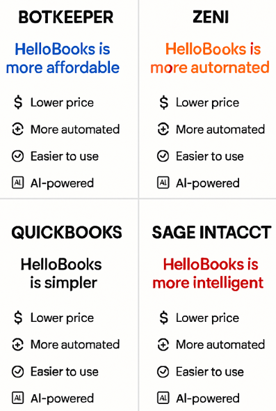
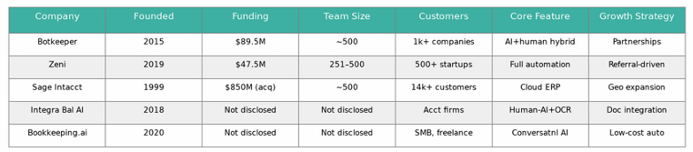

<h1 align="center">💼 Hellobooks Product Strategy Case Study</h1>

<p align="center">
<strong>Market Research • Competitive Intelligence • Product Positioning • Strategic Recommendations for an AI-Powered Bookkeeping Platform</strong>
</p>

<p align="center">
  
  
  
  
</p>

---

# 📖 Overview

This repository presents a **Product Strategy Case Study** completed as part of a **Business Analyst Internship Assignment** for **Meru Technosoft Pvt. Ltd.**

The objective was to analyze the rapidly growing **AI Bookkeeping** industry, evaluate **Hellobooks** against leading competitors, identify product gaps, and propose strategic recommendations that strengthen product positioning and long-term business growth.

Rather than simply comparing products, this study applies **Product Thinking** to understand market dynamics, evaluate feature maturity, benchmark competitors, identify opportunities, and recommend a roadmap that improves product-market fit.

---

# 📊 Project Highlights

## 🏆 Competitor Analysis

A comparative analysis of the leading AI bookkeeping platforms based on funding, company scale, customer base, product capabilities, and growth strategy.

<p align="center">
  
</p>

---

## 💡 Strategic Product Recommendations

Recommended high-impact initiatives designed to improve product differentiation, customer acquisition, and long-term scalability.

<p align="center">
  
</p>

---

## 🚀 Competitive Positioning Strategy

A positioning framework demonstrating how Hellobooks can differentiate itself against key competitors through pricing, automation, usability, and AI capabilities.

<p align="center">
  
</p>

---

# 🎯 Project Objective

Develop strategic recommendations for Hellobooks by:

- Understanding the AI bookkeeping market
- Researching industry trends
- Benchmarking leading competitors
- Evaluating current product positioning
- Identifying feature gaps
- Prioritizing high-impact product initiatives
- Recommending long-term growth strategies

---

# 🔍 Project Scope

## 📈 Market Research

- AI Bookkeeping Industry Analysis
- Market Size & CAGR
- Growth Drivers
- Industry Trends
- Customer Segmentation

---

## 🏆 Competitor Benchmarking

Compared Hellobooks against:

- Botkeeper
- Zeni
- Sage Intacct
- Integra Balance AI
- Bookkeeping.ai

### Evaluation Criteria

- Funding
- Market Position
- Customer Base
- Product Features
- Growth Strategy
- Pricing Model
- AI Capabilities
- Competitive Advantages

---

## 💼 Product Analysis

Evaluated Hellobooks across multiple product dimensions:

- Product Vision
- Core Features
- User Value Proposition
- Product Messaging
- Integrations
- AI Capabilities
- Product Differentiation
- Scalability

---

## 🚀 Strategic Recommendations

Developed prioritized recommendations including:

### High Priority

- Industry-Specific Modules
- Fraud Detection
- Automated Tax Compliance
- Hybrid AI + Human Support

### Medium Priority

- Mobile Application Enhancement
- Advanced Analytics
- Predictive Insights
- API Marketplace
- Developer Ecosystem

---

# ⭐ Key Deliverables

- Executive Summary
- Market Research
- Competitor Analysis
- Product Positioning Assessment
- Feature Gap Analysis
- Strategic Recommendations
- Product Roadmap
- Growth Strategy

---

# 💡 Key Product Insights

## 📈 Market Opportunity

- AI bookkeeping is one of the fastest-growing FinTech sectors.
- Increasing AI adoption creates significant product opportunities.
- SMBs are rapidly adopting AI-powered financial solutions.

---

## ⚠ Product Gaps Identified

- Limited Pricing Transparency
- Weak Industry-Specific Positioning
- Lack of Human Support Messaging
- Minimal Enterprise Security Positioning
- Limited Product Messaging Around Integrations

---

## 🚀 High-Impact Opportunities

- Industry-specific accounting solutions
- AI-powered fraud detection
- Automated tax filing
- AI + Human support model
- Enhanced analytics
- Mobile-first product experience

---

# 📂 Repository Structure

```text
hellobooks-product-strategy-case-study
│
├── README.md
│
├── assets
│   ├── competitor-analysis.png
│   ├── strategic-recommendations.png
│   └── competitive-positioning.png
│
├── reports
│   └── Hellobooks_Product_Strategy_Case_Study.pdf
│
├── LICENSE
│
└── .gitignore
```

---

# 🛠 Skills Demonstrated

## Product

- Product Strategy
- Product Thinking
- Product Positioning
- Product Analysis
- Feature Prioritization
- Product Documentation
- Opportunity Assessment

### Business

- Business Analysis
- Strategic Planning
- Market Research
- Industry Analysis
- Competitive Intelligence

### Research

- Market Benchmarking
- Trend Analysis
- Competitive Research
- Product Evaluation

### Communication

- Executive Reporting
- Data Storytelling
- Strategic Recommendations
- Business Documentation

---

# 📌 Product Management Frameworks Applied

- Competitive Benchmarking
- Product Positioning
- Feature Gap Analysis
- Opportunity Prioritization
- Market Research
- Strategic Roadmapping
- Product Differentiation

---

# 🎯 Business Impact

This case study demonstrates the ability to:

- Evaluate products from a strategic perspective
- Translate research into actionable product recommendations
- Benchmark competitors using structured analysis
- Identify product opportunities backed by market trends
- Communicate strategic insights for Product and Business stakeholders

---

# 🚀 Future Improvements

Future iterations of this case study could include:

- SWOT Analysis
- Jobs-to-be-Done (JTBD)
- User Personas
- Value Proposition Canvas
- Product Opportunity Matrix
- Go-to-Market Strategy
- Pricing Strategy
- Product Metrics Framework
- User Journey Mapping

---

# 📄 Report

The complete case study is available inside the **reports** folder.

```text
reports/
└── Hellobooks_Product_Strategy_Case_Study.pdf
```

---

# 👨‍💻 About Me

I'm an aspiring **Product Analyst**, **Business Analyst**, and **AI-driven Data Analyst** passionate about solving business problems through product strategy, market research, competitive intelligence, and data-driven decision-making.

### 🌐 Portfolio

**https://swasthikkp0port.netlify.app/**

### 💼 LinkedIn

**https://www.linkedin.com/in/swasthik-k-p-7b927b377/**

### 📧 Email

**kpswasthik2004@gmail.com**

---

<p align="center">
⭐ If you found this project interesting, consider starring the repository.
</p>

<p align="center">
<b>Product Strategy • Market Research • Competitive Intelligence • Business Analysis • Continuous Learning</b>
</p>
